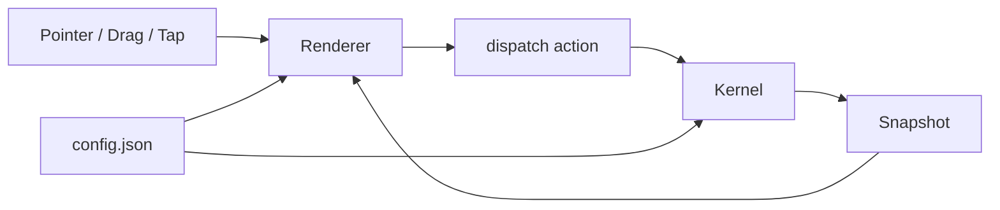
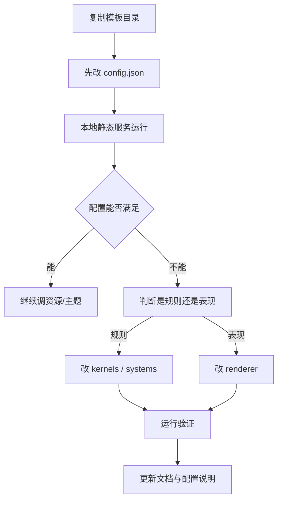

# Elimination Template No-Build

## 1. 模型执行摘要

- 当前真正运行入口：`index.html -> src/main.js`
- 当前真正运行 kernel：`src/kernels/blockBlastKernel.js`
- 当前真正运行 renderer：`src/renderers/blockPlacement/mountBlockPlacementRenderer.js`
- 当前真正运行配置：`src/config.json` + `src/config.js`
- 默认先改：`src/config.json`
- 配置不够时：
  - 规则问题改 `src/kernels/blockBlastKernel.js`
  - 表现问题改 `src/renderers/blockPlacement/mountBlockPlacementRenderer.js`
- 默认不要改：
  - `src/core/contracts.js`
  - `src/core/kernelFactory.js`
  - `src/kernels/blockPlacementKernel.ts`
  - `src/renderers/pixiTemplateRenderer.js`
  - `src/styles/ui-layer.css`

执行顺序：

1. 先判断需求是配置、规则、还是表现。
2. 能只改 `src/config.json` 就不要先改代码。
3. 规则只进 kernel；UI、动画、输入映射、媒体只进 renderer。
4. 改完先验证运行，再补文档。

## 2. 强约束

- 不要把玩法判定写进 renderer。
- 不要把 Pixi / DOM / 音视频控制写进 kernel。
- 不要把新需求一上来就扩散到多个文件。
- 不要优先改历史兼容文件。
- 不要默认改 `core` 层，除非是在新增玩法模式并需要注册新 kernel。
- 不要把 `src/kernels/blockPlacementKernel.ts` 当成运行时主文件；它只是 TS 镜像。
- 不要把 `src/renderers/pixiTemplateRenderer.js` 当成主 renderer；它不是当前运行链。
- 不要为了小改动破坏现有分层边界：
  - `config` 管参数
  - `kernel` 管规则
  - `systems` 管纯逻辑复用
  - `renderer` 管视觉、交互、媒体、动画

默认禁止修改清单：

- `src/core/contracts.js`
- `src/core/kernelFactory.js`
- `src/kernels/blockPlacementKernel.ts`
- `src/renderers/pixiTemplateRenderer.js`
- `src/styles/ui-layer.css`

只有在以下情况才允许动它们：

- `src/core/kernelFactory.js`：新增新玩法模式，需要注册新 kernel
- `src/core/contracts.js`：overlay 或共享数据结构本身要扩字段
- `src/kernels/blockPlacementKernel.ts`：你明确要维护 TS 镜像与 JS 同步
- `src/renderers/pixiTemplateRenderer.js` / `src/styles/ui-layer.css`：你明确在处理历史遗留，而不是当前运行链

## 3. 一句话数据流

`config.json -> config.js -> kernel state/snapshot -> renderer -> 用户输入 -> kernel.dispatch() -> 新 snapshot`

## 4. 改动优先级

1. `src/config.json`
2. `src/config.js`
3. `src/kernels/blockBlastKernel.js`
4. `src/renderers/blockPlacement/mountBlockPlacementRenderer.js`
5. `src/systems/lineClearSystem.js`
6. `src/kernels/shapeLibrary.js`
7. `src/core/kernelFactory.js`

判断规则：

- 换文案、换色、换背景、换媒体、换 HUD、换计分参数、换 shape 池、换初始棋盘：先改 `src/config.json`
- 配置是平铺的，但运行时需要数组/对象：改 `src/config.js`
- 需求影响合法放置、生成、清线、得分、目标、胜负：改 `src/kernels/blockBlastKernel.js`
- 需求影响布局、拖拽反馈、投影、粒子、扫描线、面板、媒体、按钮反馈：改 `src/renderers/blockPlacement/mountBlockPlacementRenderer.js`
- 需求是纯清线算法复用：改 `src/systems/lineClearSystem.js`
- 需求是 shape 几何定义或别名：改 `src/kernels/shapeLibrary.js`

## 5. 需求到文件映射速查

- 改标题 / RULE 文案 -> `src/config.json`
- 改背景图 / 视频 / gif / 音乐 -> `src/config.json`
- 改棋盘背景色 / 透明度 / 圆角 -> `src/config.json`
- 改 HUD 配色 / 字体 / 字号 / 面板媒体 -> `src/config.json`
- 改 block 默认颜色池 -> `src/config.json`
- 改初始棋盘填充 -> `src/config.json`
- 改 shape 池顺序或内容 -> `src/config.json`
- 改 gem 目标 -> `src/config.json`
- 把平铺配置聚合成列表 -> `src/config.js`
- 增加新配置读取 helper -> `src/config.js`
- 改放置是否合法 -> `src/kernels/blockBlastKernel.js`
- 改出块规则 -> `src/kernels/blockBlastKernel.js`
- 改清线逻辑 -> `src/kernels/blockBlastKernel.js` 或 `src/systems/lineClearSystem.js`
- 改 gem 计数 / 目标完成条件 -> `src/kernels/blockBlastKernel.js`
- 改胜负判定 -> `src/kernels/blockBlastKernel.js`
- 改拖拽投影样式 -> `src/renderers/blockPlacement/mountBlockPlacementRenderer.js`
- 改宝石材质 / block 纹理 -> `src/renderers/blockPlacement/mountBlockPlacementRenderer.js`
- 改粒子爆炸 -> `src/renderers/blockPlacement/mountBlockPlacementRenderer.js` 和 `src/renderers/common/ParticleSystem.js`
- 改扫描激光 / beam -> `src/renderers/blockPlacement/mountBlockPlacementRenderer.js`
- 改背景媒体挂载 / 音频解锁 -> `src/renderers/blockPlacement/mountBlockPlacementRenderer.js`
- 新增 shape 定义 -> `src/kernels/shapeLibrary.js`
- 新增新玩法模式 -> 新建 `src/kernels/<newKernel>.js` + 改 `src/core/kernelFactory.js`

## 6. 目录职责

### 根目录

- `SKILL.md`
  - 当前文件；给模型的执行规约
- `README.md`
  - 项目运行说明
- `策划案.md`
  - 玩法和配置清单
- `index.html`
  - CDN import map、页面壳、运行入口页面

### `src/`

- `src/main.js`
  - 启动应用；挂载 kernel 与 renderer
- `src/config.json`
  - 单一配置源
- `src/config.js`
  - 配置读取、兼容映射、列表型配置聚合

### `src/core/`

- `src/core/kernelFactory.js`
  - 根据 `gameplay_mechanics_active` 选择 kernel
- `src/core/contracts.js`
  - 最小共享结构；当前主要是 `createOverlay()`

### `src/kernels/`

- `src/kernels/blockBlastKernel.js`
  - 当前运行时真正使用的规则层
- `src/kernels/blockPlacementKernel.ts`
  - TS 镜像；不是 no-build 运行主链
- `src/kernels/shapeLibrary.js`
  - shape 库、别名归一化
- `src/kernels/placeholderKernel.js`
  - 未注册模式的占位实现

### `src/systems/`

- `src/systems/lineClearSystem.js`
  - 可复用纯规则逻辑；不碰 Pixi / DOM

### `src/renderers/`

- `src/renderers/blockPlacement/mountBlockPlacementRenderer.js`
  - 当前真正运行 renderer
  - 负责：
    - Pixi UI
    - 布局
    - 背景媒体
    - HUD
    - 拖拽
    - 投影
    - 粒子
    - 扫描线
    - 按钮反馈
- `src/renderers/common/ParticleSystem.js`
  - 粒子系统
- `src/renderers/pixiTemplateRenderer.js`
  - 历史遗留 renderer；默认不要改

### `src/styles/`

- `src/styles/ui-layer.css`
  - 历史遗留样式文件；当前主链不是靠它完成 UI

## 7. 配置约定

### 7.1 结构

- `src/config.json` 使用平铺 key
- 叶子统一结构：`{ value, type, label }`
- `_` 开头 key 视为只读

示例：

```json
"theme_primary": {
  "value": "oklch(0.756 0.147 235.2)",
  "type": "color",
  "label": "主色"
}
```
 
颜色字段说明：

- 当前模板颜色值支持浏览器可识别的 CSS 颜色字符串
- 默认优先使用：
  - `oklch(...)`
- 只有在以下情况才退回其他格式：
  - 目标颜色无法方便地用 `oklch(...)` 调整
  - 需要直接复用外部现成色值
  - 需要短期兼容旧配置而不想重算颜色
- 可接受的退回格式：
  - `#RRGGBB`
  - `rgb(...)`
  - `hsl(...)`
- 当前 renderer 已支持把这些颜色格式解析为运行时颜色
- 如果配置项语义是“颜色”，优先保持为纯颜色字符串，不要混入图片 URL 或其他值

### 7.2 命名

- 命名格式：`domain_subdomain_field`
- 示例：
  - `gameplay_board_rows`
  - `presentation_hud_rule_text`
  - `theme_background_media`

### 7.3 列表型配置

当前不要直接把这些内容存成 `object[]` / `string[]`：

- 初始棋盘格子列表
- shape 列表
- gem 目标列表
- 默认颜色池

正确做法：

- 在 `src/config.json` 里写成带序号的平铺 key
- 在 `src/config.js` 里聚合

当前已存在的聚合 helper：

- `buildInitialBoardFilledCells()`
- `buildShapePool()`
- `buildGemTargets()`
- `buildThemePieceColors()`

当前已存在的序号模式：

- `gameplay_initial_board_cell_<n>_row`
- `gameplay_initial_board_cell_<n>_col`
- `gameplay_initial_board_cell_<n>_color`
- `gameplay_initial_board_cell_<n>_gem_type`
- `gameplay_shape_<n>`
- `gameplay_gem_target_<n>_type`
- `gameplay_gem_target_<n>_count`
- `theme_piece_color_<n>`

扩充规则：

- 新增第 4 个初始格子：补 `gameplay_initial_board_cell_4_*`
- 新增第 7 个 shape：补 `gameplay_shape_7`
- 新增第 3 个 gem 目标：补 `gameplay_gem_target_3_type` 和 `gameplay_gem_target_3_count`

### 7.4 读取规则

- 新代码优先用平铺 key
- 兼容旧点路径只用于历史兼容，不要继续扩散
- 当前 `config.js` 能兼容：
  - 平铺 key 直接读取
  - 部分点路径映射为平铺 key
  - 列表型配置聚合
- 颜色相关字段会继续透传到 renderer，由 renderer 统一解析；当前已支持 `oklch(...)`

## 8. 最常用配置键

### 玩法

- `gameplay_grid_size`
- `gameplay_board_rows`
- `gameplay_board_cols`
- `gameplay_rules_bag_size`
- `gameplay_mechanics_active`
- `gameplay_gem_spawn_chance`
- `gameplay_scoring_per_cell`
- `gameplay_scoring_per_line`
- `gameplay_scoring_per_gem`
- `gameplay_scoring_target_score`

### 初始棋盘

- `gameplay_initial_board_cell_<n>_row`
- `gameplay_initial_board_cell_<n>_col`
- `gameplay_initial_board_cell_<n>_color`
- `gameplay_initial_board_cell_<n>_gem_type`

### shape 池

- `gameplay_shape_<n>`

shape 名会被 `src/kernels/shapeLibrary.js` 归一化。当前内置主 shape：

- `single`
- `line2`
- `line3`
- `line4`
- `L`
- `square`
- `T`

当前别名：

- `line -> line3`
- `square2 -> square`
- `L3 -> L`
- `T4 -> T`

### gem 目标

- `gameplay_gem_target_<n>_type`
- `gameplay_gem_target_<n>_count`

### 表现策略

- `presentation_ui_template`
- `presentation_animation_clear`
- `presentation_animation_place`
- `presentation_interaction_drag_preview`
- `presentation_interaction_highlight_valid`
- `presentation_hud_title`
- `presentation_hud_rule_text`

### 背景与主题

- `theme_glow`
- `theme_primary`
- `theme_accent`
- `theme_background_top`
- `theme_background_bottom`
- `theme_background_media`
- `theme_background_media_type`
- `theme_background_video`
- `theme_background_music`

说明：

- `theme_background_media` 是主入口
- `theme_background_video` 是旧兼容字段，优先级低于 `theme_background_media`

### 棋盘

- `theme_board_bg`
- `theme_board_alpha`
- `theme_board_radius`
- `theme_board_media`
- `theme_board_media_type`
- `theme_board_media_alpha`
- `theme_grid_line`

### HUD

- `theme_hud_panel_bg`
- `theme_hud_panel_alpha`
- `theme_hud_panel_radius`
- `theme_hud_panel_media`
- `theme_hud_panel_media_type`
- `theme_hud_panel_media_alpha`
- `theme_hud_font_family`
- `theme_hud_label_color`
- `theme_hud_label_rule_color`
- `theme_hud_value_score_color`
- `theme_hud_value_rule_color`
- `theme_hud_value_best_color`
- `theme_hud_label_font_size`
- `theme_hud_rule_label_font_size`
- `theme_hud_value_score_font_size`
- `theme_hud_value_rule_font_size`
- `theme_hud_value_best_font_size`

### 蒙层

- `theme_scene_overlay_alpha`
- `theme_scene_overlay_image`
- `theme_scene_overlay_image_alpha`
- `theme_tray_overlay_alpha`
- `theme_tray_overlay_image`
- `theme_tray_overlay_image_alpha`

### block / 宝石材质

- `theme_block_radius`
- `theme_block_media`
- `theme_block_media_type`
- `theme_block_media_alpha`
- `theme_piece_color_<n>`

说明：

- 配了 `theme_block_media` 时，renderer 优先走媒体材质
- 不配 `theme_block_media` 时，默认从 `theme_piece_color_<n>` 颜色池取色

## 9. 新游戏接入流程

1. 复制模板目录。
2. 先只改 `src/config.json`，不要先动代码。
3. 运行静态服务器验证现有模板是否已经足够。
4. 如果规则不满足，改 `src/kernels/blockBlastKernel.js`。
5. 如果只是表现不满足，改 `src/renderers/blockPlacement/mountBlockPlacementRenderer.js`。
6. 如果是平铺配置无法直接表达列表，改 `src/config.js` 增加聚合 helper。
7. 如果要增加新 shape，改 `src/kernels/shapeLibrary.js`。
8. 只有在新增新玩法模式时，才新建 kernel 并改 `src/core/kernelFactory.js`。
9. 改完后同步更新 `SKILL.md`、`策划案.md`。

本地运行：

```bash
python -m http.server 8080
```

或：

```bash
npx serve .
```

不要直接用 `file://` 打开。

## 10. 模型判断模板

收到需求后，按下面顺序判断：

1. 这是换参数还是换规则还是换表现？
2. `src/config.json` 能否直接满足？
3. 如果不能，是缺一个读取 helper，还是缺规则，还是缺 renderer 样式？
4. 这个改动会不会破坏 kernel / renderer 边界？
5. 是否误改了历史文件而不是当前运行文件？

可直接套用：

- “只是换资源、颜色、文本、面板、媒体、分值” -> 先改 `src/config.json`
- “需要把平铺 key 组装为数组/对象” -> 改 `src/config.js`
- “需要改规则结果” -> 改 `src/kernels/blockBlastKernel.js`
- “需要改视觉结果或交互反馈” -> 改 `src/renderers/blockPlacement/mountBlockPlacementRenderer.js`
- “需要新增形状定义” -> 改 `src/kernels/shapeLibrary.js`
- “需要新增模式” -> 新 kernel + 改 `src/core/kernelFactory.js`

## 11. 常见误改提醒

- 改了 `src/kernels/blockPlacementKernel.ts` 没生效
  - 原因：运行时实际走的是 `src/kernels/blockBlastKernel.js`

- 改了 `src/renderers/pixiTemplateRenderer.js` 没生效
  - 原因：当前主 renderer 是 `src/renderers/blockPlacement/mountBlockPlacementRenderer.js`

- 一上来改 `src/core/kernelFactory.js`
  - 通常是误改；多数需求根本不需要碰 `core`

- 在 renderer 里写“是否可放置 / 是否结束 / 如何得分”
  - 这是越界；应该回到 kernel

- 在 kernel 里做背景视频、按钮反馈、粒子、Pixi 绘制
  - 这是越界；应该回到 renderer

- 把列表型配置重新改回 `object[]`
  - 不要这样做；保留平铺 key + `config.js` 聚合

- 想改扫描激光、危险 beam、部分粒子细节，却只改 `config.json`
  - 当前这些样式仍在 renderer 中写死；应改 `renderDangerBeam()` 或对应动画代码

- 配了背景媒体却没显示
  - 先查：
    - `theme_background_media`
    - `theme_background_media_type`
    - 浏览器是否拦截媒体播放

- 配了背景音乐却没声音
  - 多半是浏览器自动播放策略；先点击页面或点击开始按钮触发解锁

- 配了 `theme_block_media` 但仍显示默认宝石
  - 检查 URL、媒体类型、renderer 是否识别为 `image/gif/video`

## 12. 最小验收清单

每次改动后至少确认：

1. 页面能启动
2. 点击开始能进入游戏
3. HUD 正常显示
4. 背景媒体层级正常
5. 拖拽、投影、落点一致
6. 合法位置能放，非法位置不能放
7. 清线行为正确
8. gem 统计正确
9. 分数变化正确
10. 游戏结束逻辑正确
11. `theme_block_media` 与默认颜色池回退正常
12. 配置改动确实落在当前运行文件上，而不是历史文件

## 13. 模板定位（简版）

这是一个用于快速落地放置消除 / 网格消除类游戏的 no-build 模板。

定位：

- CDN + 原生 ESM
- 纯 JavaScript 主运行链
- Pixi renderer
- 配置优先
- 规则与表现分离

适合：

- 快速做可运行原型
- 快速验证 UI、资源、动效、配置驱动
- 在明确边界下迭代单玩法模板

不适合：

- 重工程化正式主线
- 复杂多模式长期维护
- 依赖完整 TS 工程链的项目
---
name: elimination-template-nobuild-game-builder
description: 基于 elimination-template-nobuild（CDN + JS + 无构建）快速创建或改造放置消除/网格消除类游戏模板。重点说明目录职责、配置键作用、修改影响、扩充方式与验证流程。
---

# Elimination Template No-Build 模板技能

## 模板目标

`elimination-template-nobuild` 是一个面向 **放置消除 / 清线 / 网格休闲玩法** 的无构建模板。

它的目标不是做“最终工程化主线”，而是：

- 用纯 JavaScript + CDN 快速落地一个可运行版本
- 让模型先通过 `config.json` + 少量规则改造完成新游戏
- 保持 `kernel / renderer / config / systems` 职责边界清晰
- 在没有构建工具的前提下仍然具备较强的模板复用性

当前运行特征：

- 纯 JavaScript（无 TypeScript 运行主链）
- 浏览器 ESM + CDN
- 当前主依赖：`pixi.js`、`gsap`
- 入口：`index.html -> src/main.js`
- 静态服务器即可运行

---

## 什么时候用这个模板

适合：

- Block Blast / Block Placement 类放置清线玩法
- 要快速试 UI、资源、特效、手感的休闲游戏原型
- 要验证配置驱动能力，而不是先搭建构建链路

不适合：

- 强工程化正式主线开发
- 复杂多模式、多团队长周期维护
- 对类型系统和自动化构建依赖很强的项目

---

## 核心原则

1. `kernel` 只负责规则与状态推进。
2. `renderer` 只负责表现、交互、媒体、动画与 UI。
3. `config.json` 是单一配置源，优先改配置，不先改逻辑。
4. 纯逻辑优先抽到 `systems`，不要堆进 renderer。
5. 不在 renderer 写玩法判定。
6. 不在 kernel 里操作 DOM / Pixi / 音视频元素 / CSS。

---

## 一图理解数据流



一句话：

`输入 -> renderer -> action -> kernel -> snapshot -> renderer`

---

## 目录结构与职责

## 根目录文件

- `index.html`
  - 无构建入口
  - 定义 import map
  - 挂载 `#app`
  - 只负责壳，不写玩法

- `README.md`
  - 外部阅读入口
  - 告诉使用者这是个什么模板、如何运行

- `SKILL.md`
  - 当前文档
  - 给模型和开发者看的“模板操作手册”

- `策划案.md`
  - 当前模板的玩法、UI、配置清单与产品化说明

---

## `src/` 目录

### `src/main.js`

职责：

- 读取根节点
- 创建 kernel
- 挂载 renderer

当前主线：

- `createKernel()`
- `mountBlockPlacementRenderer()`

影响：

- 改这里会影响启动路径和运行模式
- 一般只在“新增新模式 renderer”时才改

### `src/config.json`

职责：

- 单一配置源
- 采用 **平铺 key**
- 每项结构：`{ value, type, label }`

影响：

- 改这里会影响玩法参数、资源地址、样式主题、HUD 文案、材质、背景、BGM、遮罩等

### `src/config.js`

职责：

- 统一配置读取
- 支持平铺 key 读取
- 保留少量兼容聚合能力

当前主要能力：

- `getSetting(path, fallback)`
- `getConfigEntry(path)`
- `isConfigPathEditable(path)`
- `listConfigLeafPaths()`
- `listEditableConfigPaths()`
- `getBackgroundMediaSettings()`
- `buildThemePieceColors()`
- `buildInitialBoardFilledCells()`
- `buildShapePool()`
- `buildGemTargets()`

注意：

- 主运行链现在已经优先使用平铺 key
- 这里保留的点路径兼容主要是为了历史兼容，不建议继续新增新代码依赖旧点路径
- 形状池、初始填充格子、gem 目标、颜色池这几类“列表型配置”已经通过 helper 从平铺 key 聚合，不再直接在 `config.json` 里保存 `object[]` / `string[]`

---

## `src/core/`

### `src/core/contracts.js`

职责：

- 放最小共享结构
- 当前提供 `createOverlay(title, body, buttonText)`

影响：

- 改这里会影响所有 overlay 数据结构
- 只有当 overlay 结构本身要扩展字段时才改

### `src/core/kernelFactory.js`

职责：

- 根据 `gameplay_mechanics_active` 选择 kernel

当前逻辑：

- `blockblast` -> `BlockBlastKernel`
- 其他 -> `createPlaceholderKernel()`

影响：

- 新增玩法模式时，必须改这里

---

## `src/kernels/`

### `src/kernels/blockBlastKernel.js`

职责：

- 当前运行时真正使用的 kernel
- 负责：
  - 棋盘初始化
  - 方块生成
  - preview 合法性
  - 放置
  - 清线
  - gem 统计
  - 分数计算
  - 结束判定
  - snapshot 输出

你改这里会造成什么影响：

- 改放置合法性 -> 玩家能不能放、哪里能放
- 改 `clearCompletedLines()` -> 清线行为和奖励变化
- 改 `checkEndState()` -> 胜负逻辑变化
- 改 `createPiece()` / `randomPieceColor()` -> 出块、颜色、随机性变化

不该在这里做的事：

- 播放音频
- 画 Pixi 节点
- 处理 DOM
- 做按钮反馈

### `src/kernels/shapeLibrary.js`

职责：

- 维护形状库
- 提供别名归一化

你改这里会造成什么影响：

- 新增 / 删除 / 替换 shape
- 修改同名 shape 的几何结构

适用：

- 增加新的拼块类型

### `src/kernels/placeholderKernel.js`

职责：

- 当配置了未实现的 kernel 时，提供兜底 snapshot

影响：

- 一般不改
- 只在你要改“未支持玩法的报错文案或兜底 UI”时才改

### `src/kernels/blockPlacementKernel.ts`

职责：

- TypeScript 镜像 / 参考文件
- 不是当前 no-build 运行入口

用途：

- 给未来迁移到 TS 或对照阅读时用

---

## `src/systems/`

### `src/systems/lineClearSystem.js`

职责：

- 纯逻辑清线函数
- 输入矩阵与判定函数
- 输出：
  - `clearedLines`
  - `clearedPositions`

你改这里会造成什么影响：

- 所有依赖它的“整行整列消除”行为都会变

适用：

- 想改清线检测规则时优先看这里

---

## `src/renderers/`

### 当前主路径：`src/renderers/blockPlacement/mountBlockPlacementRenderer.js`

职责：

- 挂载 Pixi App
- 管理背景媒体、背景音乐、蒙层
- 绘制棋盘 / HUD / 托盘
- 处理拖拽输入
- 做特效、粒子、扫描线、反馈

文件内的核心组件：

- `BoardGrid`
  - 棋盘大面板、cell、preview、block 材质
- `Tray`
  - 底部三个待放置方块区域
- `HUD`
  - 顶部信息面板、overlay 弹层、开始按钮
- `DragController`
  - 拖拽开始 / 移动 / 放置 / ghost
- `AnimationController`
  - snap、clear、combo、shake、beam、flash 等动画

你改这里会造成什么影响：

- 改布局 -> 棋盘、HUD、托盘位置变化
- 改 `drawBackground()` -> 背景绘制策略变化
- 改 `createMaskedMediaNode()` -> 图片/gif/video 贴图方式变化
- 改 `BoardGrid.getBlockTexture()` -> 默认宝石材质变化
- 改 `HUD.render()` -> 字体、面板、按钮、overlay 变化
- 改 `DragController` -> 拖拽手感和落点预览变化
- 改 `AnimationController` -> 视觉反馈节奏变化

### `src/renderers/common/ParticleSystem.js`

职责：

- 纯 Canvas2D 粒子系统
- 不依赖第三方粒子库
- 支持颜色渐变爆炸

你改这里会造成什么影响：

- 所有清线/爆炸粒子的密度、生命周期、颜色、性能表现变化

### `src/renderers/pixiTemplateRenderer.js`

职责：

- 旧参考 renderer
- 不是当前运行主路径

用途：

- 只作为早期简化版参考
- 不要误以为现在运行时在用它

---

## `src/styles/`

### `src/styles/ui-layer.css`

职责：

- 目前是 legacy 占位样式文件
- 当前主 UI 大部分仍在 Pixi 内部绘制

什么时候改它：

- 只有当你要把一部分 DOM 壳层样式从 renderer 内联代码抽出来时才改

---

## 当前主运行路径

真正要认准的 4 个文件：

- `src/config.json`
- `src/config.js`
- `src/kernels/blockBlastKernel.js`
- `src/renderers/blockPlacement/mountBlockPlacementRenderer.js`

如果模型基于这个模板实现新游戏，优先围绕这 4 个文件工作。

---

## 配置系统说明

## 命名规则

- 全平铺：`domain_subdomain_field`
- 示例：
  - `gameplay_board_rows`
  - `presentation_hud_rule_text`
  - `theme_background_media`
- 列表型配置也要平铺，用“序号 + 字段名”的形式：
  - `gameplay_initial_board_cell_1_row`
  - `gameplay_initial_board_cell_1_col`
  - `gameplay_initial_board_cell_1_color`
  - `gameplay_initial_board_cell_1_gem_type`
  - `gameplay_shape_1`
  - `gameplay_gem_target_1_type`
  - `gameplay_gem_target_1_count`

## 配置项结构

统一写法：

```json
"theme_primary": {
  "value": "#33BDFF",
  "type": "color",
  "label": "主色"
}
```

含义：

- `value`：真实配置值
- `type`：给配置面板或模型看的类型提示
- `label`：中文说明

## 列表型配置约定

- 当前 `config.json` 不再直接维护下面这类数组：
  - 初始棋盘格子列表
  - shape 列表
  - gem 目标列表
  - 默认颜色池
- 正确做法是写成一组平铺 key，然后由 `src/config.js` 组装回运行时需要的数据结构
- 如果要追加新条目，直接继续编号：
  - 新增第 4 个初始格子：补 `gameplay_initial_board_cell_4_*`
  - 新增第 7 个 shape：补 `gameplay_shape_7`
  - 新增第 3 个 gem 目标：补 `gameplay_gem_target_3_type` / `count`
- 如果中间某项不想用了，优先清空其 `value`，不要随意改已有编号的语义

## 只读规则

- `_` 开头 key 视为只读
- 例如：
  - `_meta_name`
  - `_meta_description`

---

## `config.json` 键作用总览

## 1) 元信息

- `_meta_name`
  - 模板名称
- `_meta_description`
  - 模板说明

## 2) 玩法参数 `gameplay_*`

- `gameplay_grid_size`
  - 棋盘边长基线
- `gameplay_board_rows`
  - 棋盘行数
- `gameplay_board_cols`
  - 棋盘列数
- `gameplay_rules_bag_size`
  - 每轮生成几个方块
- `gameplay_mechanics_active`
  - 当前玩法模式标识
- `gameplay_initial_board_cell_<n>_row`
  - 第 `n` 个初始格子的行坐标
- `gameplay_initial_board_cell_<n>_col`
  - 第 `n` 个初始格子的列坐标
- `gameplay_initial_board_cell_<n>_color`
  - 第 `n` 个初始格子的颜色
- `gameplay_initial_board_cell_<n>_gem_type`
  - 第 `n` 个初始格子挂载的 gem 类型；空字符串表示无 gem
- `gameplay_shape_<n>`
  - 第 `n` 个 shape 池条目；值会交给 `shapeLibrary.js` 归一化
- `gameplay_gem_target_<n>_type`
  - 第 `n` 个 gem 目标类型
- `gameplay_gem_target_<n>_count`
  - 第 `n` 个 gem 目标数量
- `gameplay_gem_spawn_chance`
  - 方块格子生成 gem 概率
- `gameplay_scoring_per_cell`
  - 放置一个小格的得分
- `gameplay_scoring_per_line`
  - 清一条线的得分
- `gameplay_scoring_per_gem`
  - 每个 gem 的得分
- `gameplay_scoring_target_score`
  - 目标分

## 3) 表现策略 `presentation_*`

- `presentation_ui_template`
  - UI 模板标识
- `presentation_animation_clear`
  - 清除动画方案
- `presentation_animation_place`
  - 放置动画方案
- `presentation_interaction_drag_preview`
  - 是否显示拖拽 preview
- `presentation_interaction_highlight_valid`
  - 是否高亮合法区域
- `presentation_hud_title`
  - 顶部标题
- `presentation_hud_rule_text`
  - RULE 文案

## 4) 背景与全局主题 `theme_*`

- `theme_glow`
  - 发光风格标识
- `theme_primary`
  - 主色
- `theme_accent`
  - 强调色
- `theme_background_top`
  - 回退背景顶部色
- `theme_background_bottom`
  - 回退背景底部色
- `theme_background_media`
  - 全局背景媒体地址
- `theme_background_media_type`
  - 背景媒体类型
- `theme_background_video`
  - 背景视频兼容字段，优先级低于 `theme_background_media`
- `theme_background_music`
  - 背景音乐

## 5) 棋盘样式

- `theme_board_bg`
  - 棋盘大面板背景色
- `theme_board_alpha`
  - 棋盘大面板透明度
- `theme_board_radius`
  - 棋盘圆角
- `theme_board_media`
  - 棋盘媒体贴图
- `theme_board_media_type`
  - 棋盘媒体类型
- `theme_board_media_alpha`
  - 棋盘媒体透明度
- `theme_grid_line`
  - 网格线颜色

## 6) HUD 样式

- `theme_hud_panel_bg`
  - HUD 面板背景色
- `theme_hud_panel_alpha`
  - HUD 面板透明度
- `theme_hud_panel_radius`
  - HUD 面板圆角
- `theme_hud_panel_media`
  - HUD 面板媒体贴图
- `theme_hud_panel_media_type`
  - HUD 面板媒体类型
- `theme_hud_panel_media_alpha`
  - HUD 面板媒体透明度
- `theme_hud_font_family`
  - HUD 字体族
- `theme_hud_label_color`
  - SCORE/BEST 标签色
- `theme_hud_label_rule_color`
  - RULE 标签色
- `theme_hud_value_score_color`
  - SCORE 数字色
- `theme_hud_value_rule_color`
  - RULE 正文色
- `theme_hud_value_best_color`
  - BEST 数字色
- `theme_hud_label_font_size`
  - HUD 标签字号
- `theme_hud_rule_label_font_size`
  - RULE 标签字号
- `theme_hud_value_score_font_size`
  - SCORE 字号
- `theme_hud_value_rule_font_size`
  - RULE 字号
- `theme_hud_value_best_font_size`
  - BEST 字号

## 7) 蒙层

- `theme_scene_overlay_alpha`
  - 全屏黑色蒙层透明度
- `theme_scene_overlay_image`
  - 全屏蒙层图片
- `theme_scene_overlay_image_alpha`
  - 全屏蒙层图片透明度
- `theme_tray_overlay_alpha`
  - 底部选择区黑色蒙层透明度
- `theme_tray_overlay_image`
  - 底部选择区蒙层图片
- `theme_tray_overlay_image_alpha`
  - 底部选择区蒙层图片透明度

## 8) 方块 / 宝石材质

- `theme_block_radius`
  - 方块圆角系数
- `theme_block_media`
  - 方块材质媒体（image/gif/video）
- `theme_block_media_type`
  - 方块材质媒体类型
- `theme_block_media_alpha`
  - 方块材质媒体透明度
- `theme_piece_color_1 ~ theme_piece_color_N`
  - 默认颜色池
  - 当没有配置 `theme_block_media` 时，block 默认从这些颜色里取值

---

## 改什么会造成什么影响

## 只改配置，不改代码

适用：

- 换主题
- 换背景
- 换音乐
- 改标题
- 改字体
- 改棋盘颜色
- 改 HUD 面板颜色
- 改 block 媒体

影响：

- 不会改变规则
- 会立即改变视觉和参数
- 但不会覆盖所有写死在 renderer 里的效果样式，例如危险扫描激光、部分粒子细节、默认空白 cell 视觉等

优先改：

- `src/config.json`

## 改 `blockBlastKernel.js`

适用：

- 新玩法规则
- 新目标规则
- 新结束条件
- 新随机逻辑
- 新清线逻辑

影响：

- 玩家行为、得分、胜负、bag、出块都会变

## 改 `shapeLibrary.js`

适用：

- 新增新方块形状
- 修改方块结构

影响：

- 所有出块内容和形状池变化

## 改 `lineClearSystem.js`

适用：

- 改清线判定

影响：

- 所有整行整列消除行为变化

## 改 `mountBlockPlacementRenderer.js`

适用：

- 调布局
- 调 HUD
- 调按钮反馈
- 调背景
- 调媒体层
- 调 block 默认宝石材质
- 调拖拽与动效

影响：

- 视觉、交互、手感立即变化
- 不应该改变玩法真相

## 改 `ParticleSystem.js`

适用：

- 调粒子数量
- 调粒子生命周期
- 调爆炸颜色渐变

影响：

- 清线、爆炸、gem 飞行等粒子表现变化

---

## 新游戏接入推荐流程



详细步骤：

1. 复制 `games/elimination-template-nobuild/`
2. 先只改 `src/config.json`
3. 用静态服务器跑起来
4. 观察哪些需求配置能满足，哪些不能
5. 不能满足时再决定改 `kernel` 还是 `renderer`
6. 最后更新 `SKILL.md` / `策划案.md`

---

## 如果现有方法不满足，如何扩充

## 情况 A：配置键不够

做法：

1. 在 `src/config.json` 新增平铺 key
2. 在 `src/kernels/blockBlastKernel.js` 或 renderer 中读取它
3. 若多个字段需要聚合，可在 `src/config.js` 增加 helper

示例：

- 你要给空白 cell 颜色做配置
- 新增：
  - `theme_cell_empty_color`
  - `theme_cell_empty_alpha`
- 再在 renderer 里改读取逻辑

## 情况 B：新玩法规则不够

做法：

1. 先判断是修改 `blockBlastKernel.js` 即可，还是要新增一个新 kernel
2. 如果是新模式：
   - 新建 `src/kernels/<newKernel>.js`
   - 在 `kernelFactory.js` 注册
   - 补新的 `gameplay_mechanics_active`

## 情况 C：现有 renderer 结构不够

做法：

1. 优先在 `mountBlockPlacementRenderer.js` 内增加新组件/新 helper
2. 如果复杂度继续增长，再考虑把：
   - `BoardGrid`
   - `Tray`
   - `HUD`
   - `AnimationController`
   - `block material`
   抽成独立文件

## 情况 D：默认宝石材质不够

优先改：

- `BoardGrid.createBlockDisplay()`
- `BoardGrid.getBlockTexture()`
- `deriveBlockTones()`

如果不用默认材质：

- 直接配置 `theme_block_media`

---

## 常见问题与排查

1. 改了 `blockPlacementKernel.ts` 没生效  
   原因：运行时实际走的是 `blockBlastKernel.js`

2. 改了 `pixiTemplateRenderer.js` 没生效  
   原因：当前主渲染入口是 `blockPlacement/mountBlockPlacementRenderer.js`

3. 背景视频不显示  
   检查：
   - `theme_background_media`
   - `theme_background_media_type`
   - 浏览器是否拦截媒体播放

4. 有声音配置但没声音  
   原因通常是浏览器自动播放策略  
   先点击页面或点击开始按钮

5. 配了 `theme_block_media` 但 block 还是默认宝石  
   检查：
   - URL 是否有效
   - 类型是否正确
   - renderer 是否识别为 `image/gif/video`

6. 改了配置却没达到预期  
   先判断：
   - 这是规则问题吗
   - 这是渲染问题吗
   - 这是配置没透传到 snapshot 吗

7. 想改危险激光 / 扫描线样式却在 `config.json` 找不到  
   原因：当前危险扫描激光仍是 renderer 内写死样式，还没有配置化  
   去改：`src/renderers/blockPlacement/mountBlockPlacementRenderer.js` 里的 `renderDangerBeam()`

---

## 最小验收清单

每次改动后至少验证：

1. 页面可启动
2. 点击开始能进入游戏
3. 拖拽、投影、落点一致
4. 合法/非法放置反馈正确
5. 清线、粒子、扫描线、combo 正常
6. HUD 文案、字体、颜色生效
7. 背景媒体与背景音乐可用
8. `theme_block_media` 与默认颜色池回退正常
9. 刷新后 `best` 分数仍可读取
10. 手机尺寸下 HUD、棋盘、托盘无遮挡

---

## 给模型的执行建议

如果模型基于这个模板实现新游戏，请按下面优先级工作：

1. 先读 `src/config.json`
2. 再读 `src/kernels/blockBlastKernel.js`
3. 再读 `src/renderers/blockPlacement/mountBlockPlacementRenderer.js`
4. 只在需要扩充规则时读 `src/systems/lineClearSystem.js`
5. 不要先改 legacy 文件

优先策略：

- 先调配置
- 再调 renderer
- 最后才改 kernel

目标：

- 用最小改动完成最大复用
- 保持模板不漂移
